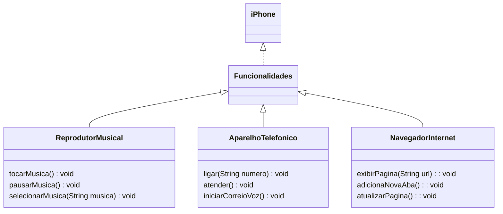

# Dio-Java-OOPclassDiagram
### Diagrama UML do exercício "DesafioUmPOO"

```mermaid
classDiagram
    class ReprodutorMusical {
       tocarMusica() void
        pausarMusica() void 
       selecionarMusica(String musica) void
    }

    class AparelhoTelefonico {
      ligar(String numero) void
atender() void
iniciarCorreioVoz() void
    }

    class NavegadorInternet {
         exibirPagina(String url): void
adicionaNovaAba(): void
atualizarPagina(): void
    }

    class iPhone {
    }

    iPhone <|.. Funcionalidades
    Funcionalidades <|-- ReprodutorMusical
    Funcionalidades <|-- AparelhoTelefonico
    Funcionalidades <|-- NavegadorInternet
```

